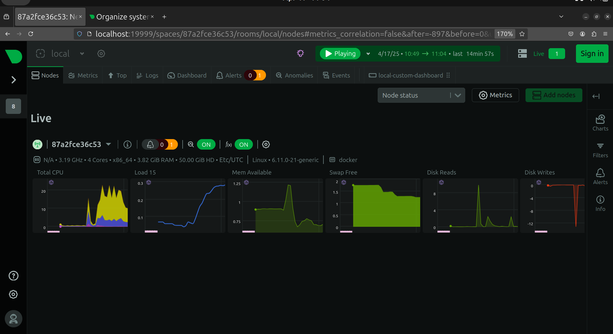
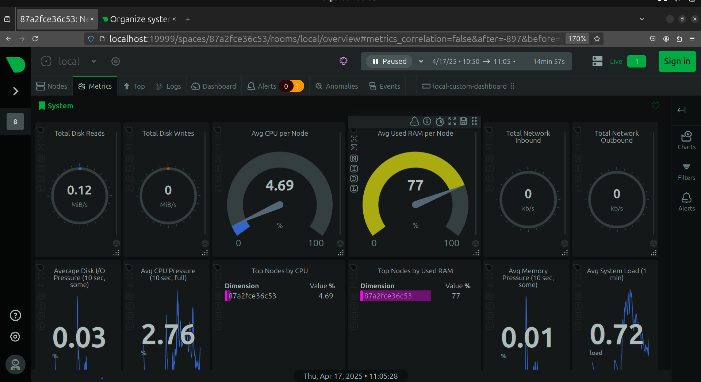

# System Performance Monitoring with Netdata

This README outlines the implementation of system performance monitoring using **Netdata**, as part of a larger initiative focused on [**Insert overarching goal here** — e.g., ensuring application stability, optimizing resource utilization, or gaining insights into system behavior].

## Project Goal

The primary goal of this project is to [**Insert detailed project goal** — e.g., proactively identify and address performance bottlenecks across application infrastructure to ensure high availability, maintain application responsiveness, and improve overall user experience].

## Netdata Integration Overview

Netdata is integrated into our system for real-time performance monitoring, enabling granular insights into both infrastructure and application behavior. This setup is especially useful for: continuous visibility into resource usage, rapid identification of performance anomalies, and facilitating proactive troubleshooting.

## Monitoring Objectives

The integration of Netdata in this project supports the following objectives: establish a performance baseline across virtual machines, detect real-time anomalies and issues, analyze trends in CPU, memory, disk, and network utilization, and support capacity planning and performance tuning.

## ## Screenshots

Visual confirmation of successful Netdata deployment:


*Figure: Main dashboard showing system health and key performance metrics.*


*Figure: Detailed performance metrics visualized by Netdata, including CPU, memory, disk, and network usage.*

## Netdata Q&A in Project Context

**1. What does Netdata monitor?** Netdata monitors critical resources on the virtual machines used in this project, including CPU utilization, memory consumption, disk I/O, network throughput, and container metrics (e.g., Docker, if applicable).

**2. How do we access real-time metrics?** Netdata’s real-time metrics are available through a web dashboard. When deployed via Docker, access it via `http://localhost:19999`. This address corresponds to the local machine where the container is running.

**3. How is Netdata different from other monitoring tools?** Netdata offers per-second granularity and instant visualization, making it ideal for local performance debugging and lightweight, fast deployment. While tools like Prometheus or Grafana excel in long-term trend analysis and multi-node monitoring, Netdata focuses on real-time insights at the node level.

**Key Performance Indicators (KPIs) Monitored:** CPU Utilization – To ensure optimal application processing. Memory Usage – To prevent memory leaks or exhaustion. Disk I/O – To analyze storage responsiveness and potential bottlenecks. Network Throughput – To monitor data transfer rates and detect network-related issues.

**4. How was Netdata deployed?** Netdata was deployed using Docker on each target virtual machine using the following command:

```bash
docker run -d --name=netdata -p 19999:19999 netdata/netdata
```

This command runs Netdata in a detached Docker container, mapping port `19999` from the container to the host, allowing access via `http://localhost:19999`.

**5. How does Netdata’s alerting help?** Netdata supports configurable alerts for any monitored metric. Alerts allow proactive identification of critical events, custom thresholds for KPIs, and integration with external notification systems (e.g., email, Slack). We plan to configure alerts for CPU spikes, memory thresholds, and I/O saturation to detect performance degradation early.

**6. What insights does the Netdata dashboard provide?** The dashboard is a central UI for real-time visualization of system metrics, historical snapshots over short time windows, drilling down into specific containers or services, and identifying performance bottlenecks.

**7. How can we troubleshoot or audit Netdata activity?** Logs related to Netdata's runtime operations, alerts, plugin executions, and system interactions can be explored in the `/var/log/netdata` directory. Reviewing these logs helps in diagnosing unexpected behaviors, ensuring Netdata services are running properly, and gaining additional visibility into background processes and plugin issues.

